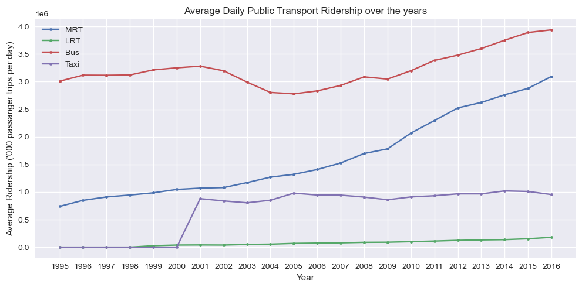
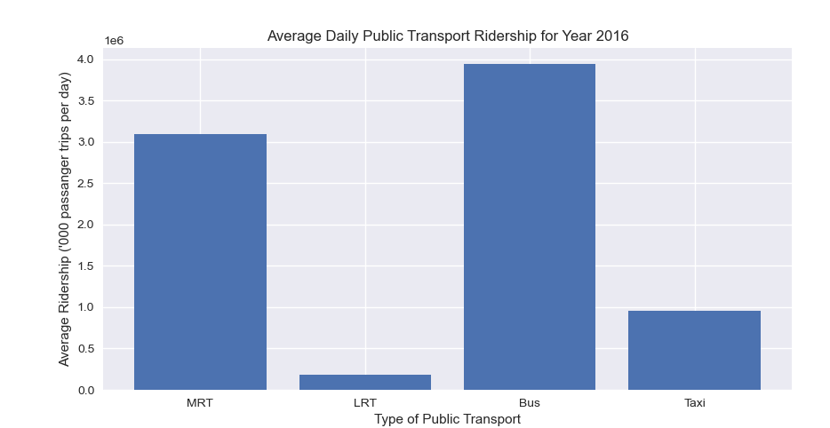

# Transport Project
Aim : To determine the most popular transportation option in Singapore and present it in python

        1. Over the years
        2. For individual years up to 2016

Ridership data:
https://data.gov.sg/dataset/public-transport-utilisation-average-public-transport-ridership

